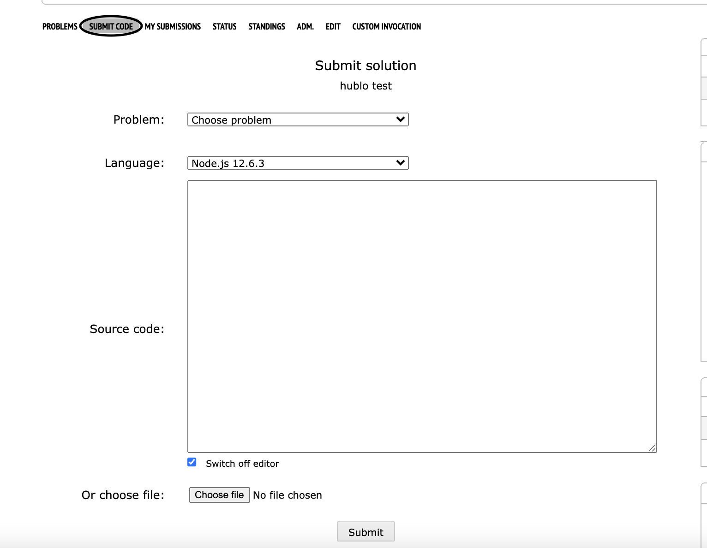

# code-retreat-solution-template

Before submitting your solution, you clearly need to code it first 🤯

For that we provide you with this file template to help you easily read the problem's input and run your solution against it. 

## How to : 

- Clone this repo.
- Use `solution.js` to write your code solution.
- In this template, your code will be excuted mainly from the main function.
- use readLine() to read the input line by line (you might need to split by an empty space) 

  Example :
   `input : 3 4`
  
  we can read this input simply :
  `[a,b] = readLine().split(' ').map(e=>parseInt(e))`
  
- To ouput the solution value you can simply use `console.log()`
- After writing you code, to test it you need to paste the input sample in the input.txt file and then simply run the command :

  `node solution.js < input.txt` 
- Finally once you finished testing your solution, to submit it simply :
  - choose the problem you want to submit
  - choose nodejs as language
  - copy paste your code , and hit the submit button! 🤞
  
  
